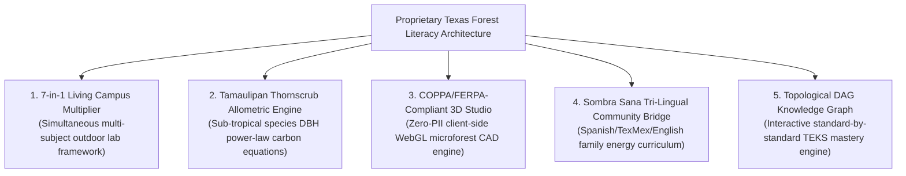
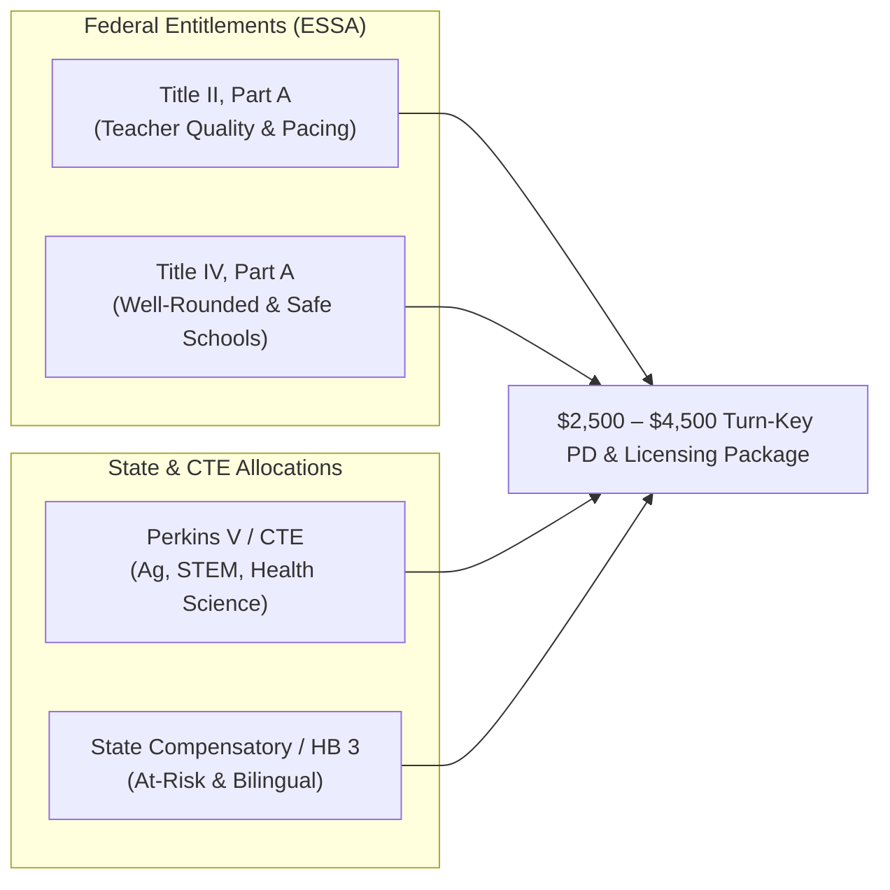
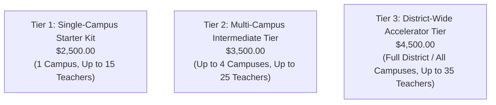

# Texas Forest Literacy & Project Cool Schools
## Turn-Key District Professional Development & Curriculum Licensing Package ($2,500 – $4,500)

**Institutional Procurement, Federal/State Compliance Crosswalk, District Pitch Briefs & 4-Hour Facilitator Workshop Master Kit**  
**Initiative:** Texas Trees Foundation & UTRGV Cool Schools Project  
**Author:** District Curriculum Procurement & Workshop Architect  
**Scope:** Region One Education Service Center (ESC 1) & South Texas Public School Districts (Donna ISD, Mercedes ISD, PSJA ISD, McAllen ISD, Harlingen CISD)  
**Publication Date:** September 2026  
**Applicable School Years:** 2026–2027 / 2027–2028  

---

# Table of Contents
1. [District Sole-Source Procurement Justification Memo](#1-district-sole-source-procurement-justification-memo)
2. [Federal & State Funding Compliance Crosswalks](#2-federal--state-funding-compliance-crosswalks)
   - *Title II, Part A: Supporting Effective Instruction (Teacher Quality)*
   - *Title IV, Part A: Student Support and Academic Enrichment (SSAE)*
   - *Career & Technical Education (Perkins V) & State Compensatory Education / STEM Allotments*
3. [1-Page Custom Executive Pitch Briefs for Curriculum Directors](#3-1-page-custom-executive-pitch-briefs-for-curriculum-directors)
   - *Brief A: Donna ISD — Accelerating STEAM & Discovery Academies*
   - *Brief B: Mercedes ISD — High School CTE & Middle School Science Bridge*
   - *Brief C: Pharr-San Juan-Alamo (PSJA) ISD — Tri-City Dual-Language & Sustainability*
   - *Brief D: McAllen ISD — STEAM, AP/IB Rigor & Quinta Mazatlán Urban Forestry*
   - *Brief E: Harlingen CISD — Specialized Health/STEM Academies & Arroyo Ecology*
4. [Master 4-Hour Facilitator Agenda & Word-for-Word Slide Script](#4-master-4-hour-facilitator-agenda--word-for-word-slide-script)
   - *Course Overview & SBEC CPE Certification (4.0 CPE Hours)*
   - *Module 1: The Texas Pacing Crisis & The Multiplier Shift (0:00–0:45)*
   - *Module 2: Field Immersion & The 7-TEKS 45-Min Outdoor Lab (0:45–1:45)*
   - *Break & Regroup (1:45–2:00)*
   - *Module 3: Data Translation, Allometrics & Digital Engine (2:00–3:00)*
   - *Module 4: Co-Teaching Design, Sombra Sana & TA Rollout (3:00–4:00)*
5. [Institutional Pricing Tiers, Kit Specifications & Invoice Schedule](#5-institutional-pricing-tiers-kit-specifications--invoice-schedule)

---

# 1. District Sole-Source Procurement Justification Memo

```text
================================================================================
MEMORANDUM: SOLE-SOURCE / PROPRIETARY EDUCATIONAL SERVICE JUSTIFICATION
================================================================================
TO:         Superintendents of Schools, Chief Financial Officers, Directors of Purchasing, 
            and Assistant Superintendents of Curriculum & Instruction
FROM:       Office of Curriculum Procurement & Educational Measurement
DATE:       September 12, 2026
SUBJECT:    Sole-Source Justification & Micro-Purchase Authorization for Texas Forest 
            Literacy & Project Cool Schools Professional Development & Licensing Package
COMMODITY:  Educational Curriculum, Professional Development, and Digital Learning Software
PURCHASE:   $2,500.00 – $4,500.00 (Below $5,000 Micro-Purchase Administrative Threshold)
================================================================================
```

### 1.1. Statutory and Regulatory Authority
This procurement justification complies with all applicable federal, state, and local procurement guidelines:
1. **Texas Education Code (TEC) § 44.031(j) — Sole Source Exception:**
   Under Texas state law, school district contracts for the purchase of publications, copyrighted materials, educational software, and proprietary educational services are exempt from competitive bidding requirements when the item is available from only one source.
2. **Texas Education Code § 44.031(a) & District Board Policy CH(LOCAL):**
   Purchases under $50,000 aggregate do not require formal sealed competitive proposals. Furthermore, purchases within the **$2,500 – $4,500 threshold fall squarely within District Micro-Purchase / Small Purchase limits**, enabling direct administrative approval and rapid Purchase Order (PO) generation without board approval delays.
3. **Federal Uniform Grant Guidance (2 CFR § 200.320(a)(1) & (c)):**
   Authorizes non-competitive micro-purchases under federal grant awards (including ESSA Title I, Title II-A, Title IV-A, and Perkins V) where the cost is reasonable, falls below the simplified acquisition threshold, and provides specialized, non-duplicative educational services.

### 1.2. Statement of Unique Proprietary Methodology
The **Texas Forest Literacy & Project Cool Schools Learning Architecture** is a one-of-a-kind educational framework developed through a collaboration between the **Texas Trees Foundation (TTF)** and the **University of Texas Rio Grande Valley (UTRGV)**. No other commercial vendor, publishing house, or educational consultancy provides this proprietary combination of assets:



1. **The "Living Campus Multiplier" Pedagogical Engine (Copyrighted):**
   Conventional outdoor education programs isolate science (e.g., chlorophyll, photosynthesis). This package provides the only verified curriculum framework that compresses **7 distinct TEKS objectives across 6 academic disciplines (Science, Math, ELAR, Social Studies, Fine Arts, Health/PE) into a single 45-minute outdoor investigation**.
2. **South Texas Tamaulipan Thornscrub Allometric Data Matrix:**
   Contains proprietary biomass regression equations, sap-flow coefficients, and microclimate thermodynamic constants calibrated specifically for regional native flora (*Prosopis glandulosa*, *Ebenopsis ebano*, *Ulmus crassifolia*, *Taxodium mucronatum*, *Ehretia anacua*), validated through UTRGV agroecology field research.
3. **FERPA/COPPA-Compliant Client-Side 3D Learning Architecture:**
   Includes the proprietary **BloomsEye-Grade 3D Schoolyard Studio** and biometeorological data engine, operating entirely client-side with zero student Personally Identifiable Information (PII) collection, satisfying all district cybersecurity audits.
4. **Bilingual Family Agroecology Extension (*Sombra Sana*):**
   A turn-key family engagement model bridging classroom learning to household energy reduction (15–25% electric bill savings) and water conservation via traditional terracotta *olla* sub-surface irrigation.

### 1.3. Commercial Non-Duplication Statement
There are no other commercially available products or professional development services that offer standard-by-standard alignment to the **2024–2025 Revised Texas 3D Science TEKS** combined with South Texas thornscrub forestry data, i-Tree urban ecosystem valuation, and tri-lingual cross-curricular instructional guides.

### 1.4. Pricing Reasonableness Certification
The proposed fee structure ($2,500.00 – $4,500.00) represents an exceptional return on investment for public school districts:
* Includes complete on-site or blended **4-hour interactive educator workshop** for up to 35 teachers.
* Grants a **perpetual campus/district site license** to all digital platforms, printable field notebooks, and interactive simulation widgets.
* Provides **4.0 Texas SBEC-approved Continuing Professional Education (CPE) credits** per participant.
* Cost per educator trained is less than $100.00, well below standard regional educational service center rates ($150–$300/educator).

```text
PROCUREMENT RECOMMENDATION:
Approve immediate sole-source Purchase Order under Title II-A (Teacher Quality), Title IV-A 
(Student Support & Well-Rounded Education), or CTE Local Funds for the turnkey amount of 
$2,500.00 (Single Campus) or $4,500.00 (District-Wide Licensing Tier).
```

---

# 2. Federal & State Funding Compliance Crosswalks

Public school districts can fully fund this professional development and curriculum package using existing federal and state entitlement grants without expending local maintenance and operations (M&O) tax dollars.



---

## 2.1. Title II, Part A Compliance Crosswalk: Supporting Effective Instruction
*Statutory Authority: Elementary and Secondary Education Act (ESEA), as amended by ESSA, Title II, Part A (20 U.S.C. § 6601 et seq.)*

Title II, Part A funds are dedicated to increasing student achievement, improving teacher and leader quality, and increasing the number of effective educators who can deliver high-quality instruction to high-need, diverse student populations.

| Title II-A Allowable Use of Funds (ESSA § 2103(b)) | Project Cool Schools PD & Licensing Deliverable | Explicit Pedagogical Impact & Evidence of Compliance |
| :--- | :--- | :--- |
| **§ 2103(b)(3)(A): High-Quality, Evidence-Based Professional Development in Core Academic Subjects** | 4-Hour "Living Campus Multiplier" Workshop & Slide Script | Trains teachers to master the **2024–2025 Revised Texas 3D Science TEKS**, integrating Scientific and Engineering Practices (SEPs) and Recurring Themes and Concepts (RTCs) through living schoolyard microforests. |
| **§ 2103(b)(3)(E): Interdisciplinary Instructional Strategies to Improve Student Retention** | 6-Subject Outdoor Lab Synthesis Guides | Solves **"curriculum pacing fatigue"** by teaching educators how to hit 7 distinct TEKS standards across Science, Math, ELAR, Social Studies, Art, and Health in one 45-minute outdoor lab. |
| **§ 2103(b)(3)(B): Effective Pedagogy for Diverse Learners & English Learners (ELs)** | *Diario de la Naturaleza* Bilingual Nature Journaling & Sensory Word Banks | Provides dual-language educators with multi-sensory, hands-on strategies that build academic language proficiency in English and Spanish simultaneously. |
| **§ 2103(b)(3)(C): Science, Technology, Engineering, and Mathematics (STEM) Teacher Capacity** | DIY Clinometer Trigonometry & Allometric Carbon Modeling Protocols | Upskills middle and high school math/science teachers in applied right-triangle trigonometry, logarithmic allometric models, and environmental physics. |
| **§ 2103(b)(3)(J): Continuous Improvement & Peer Collaboration** | Departmental Co-Teaching Planning Blueprints & Technical Assistance (TA) Log | Facilitates cross-departmental co-teaching between Science, Math, English, and CTE faculty, tracking implementation milestones across campus cohorts. |

---

## 2.2. Title IV, Part A Compliance Crosswalk: Student Support & Academic Enrichment (SSAE)
*Statutory Authority: ESEA Title IV, Part A (20 U.S.C. § 7101 et seq.)*

Title IV, Part A grants focus on three distinct priority pillars. The Project Cool Schools package delivers comprehensive compliance across **all three pillars**:

```text
================================================================================
TITLE IV, PART A THREE-PILLAR COMPLIANCE MATRIX
================================================================================

[ PILLAR 1: WELL-ROUNDED EDUCATIONAL OPPORTUNITIES (ESSA § 4107) ]
• Interdisciplinary STEM & Environmental Literacy:
  Integrates living tree biology, microclimate thermodynamics, and environmental 
  conservation into standard K-12 daily coursework.
• Arts Integration (STEAM):
  Applies Fine Arts TEKS (19 TAC Ch. 117) through precision botanical scientific 
  illustration, dappled light (Komorebi) value studies, and natural thornscrub pigments.
• Rigorous Mathematics & Humanities:
  Connects real-world geometry ($A = \pi r^2$) and Indigenous Coahuiltecan ethnobotanical 
  history (19 TAC Ch. 113) directly to campus outdoor settings.

[ PILLAR 2: SAFE AND HEALTHY STUDENTS (ESSA § 4108) ]
• Pediatric Heat Illness Prevention & Thermoregulation:
  Equips physical education and health teachers (19 TAC Ch. 115) with infrared surface 
  temperature auditing protocols to assess playground blacktop heat risks (120°F–138°F).
• Real-Time Air Quality & Respiratory Health:
  Teaches students and staff how tree canopies physically filter PM2.5 particulate 
  matter, utilizing EPA AirNow / PurpleAir data to safeguard asthmatic students.
• Mental Health & Cognitive Restoration:
  Incorporates evidence-based Japanese forest bathing (*Shinrin-yoku*) protocols to reduce 
  student cortisol, improve attention spans, and lower classroom anxiety.

[ PILLAR 3: EFFECTIVE USE OF TECHNOLOGY (ESSA § 4109) ]
• Digital Micrometeorology & GIS Mapping:
  Trains educators to utilize low-cost optical particulate sensors, ArcGIS thermal 
  rasters, and the USDA Forest Service *i-Tree* eco-valuation software.
• Zero-PII 3D Schoolyard Studio:
  Deploys client-side Three.js WebGL spatial simulation tools where students design 
  future campus microforest canopies with zero student data tracking.
================================================================================
```

---

## 2.3. Career & Technical Education (Perkins V) & State Allotments

### A. Perkins V CTE Program of Study Alignment
For secondary campuses (Grades 6–12), this package directly satisfies program quality indicators under the **Strengthening Career and Technical Education for the 21st Century Act (Perkins V)**:
* **Agriculture, Food, and Natural Resources (AFNR) Cluster:**
  - *Courses Supported:* Principles of Agriculture, Forestry and Woodland Ecosystems, Soil and Water Conservation, Plant and Soil Science.
  - *Competencies:* Caliper DBH measurement, allometric timber/carbon calculations, soil macronutrient assays (*Rhizobium* nodules), and drought-tolerant polyculture cultivation.
* **Health Science Cluster:**
  - *Courses Supported:* Principles of Health Science, Public Health & Epidemiology.
  - *Competencies:* Wet-Bulb Globe Temperature (WBGT) biometeorology, pediatric heat stress profiling, and particulate matter respiratory pathophysiology.
* **STEM & Geospatial Information Systems (GIS) Cluster:**
  - *Courses Supported:* Engineering Design, Principles of Applied Engineering, GIS Technology.
  - *Competencies:* Low-cost laser particle counter calibration ($PM_{2.5}$ humidity curves), spatial canopy analysis, and thermodynamic sensor deployment.

### B. Texas State Compensatory Education (SCE) & HB 3 Allotments
* **Accelerated Instruction for At-Risk Students:** High-impact, multi-sensory outdoor labs bridge abstract STAAR concepts for struggling learners.
* **Bilingual Education Allotment:** Provides certified English Language Proficiency Standards (ELPS) alignment, supporting English Learners through contextualized nature journaling and bilingual family nights.

---

# 3. 1-Page Custom Executive Pitch Briefs for Curriculum Directors

---

## Brief A: Donna ISD — Accelerating STEAM & Discovery Academies

```text
================================================================================
EXECUTIVE CURRICULUM BRIEF: DONNA INDEPENDENT SCHOOL DISTRICT
================================================================================
TO:         Assistant Superintendent for Curriculum & Instruction & STEM Directors
CAMPUSES:   J.W. Caceres Discovery Intermediate, P.S. Garza Elementary, A.M. Ochoa 
            Science/Sports Academy, M. Rivas Discovery Academy, Capt. D. Salinas II 
            STEAM Academy, C. Stainke Intermediate, D. Singleterry Elementary, A.P. Solis MS
================================================================================
```

### The Challenge in Donna ISD
Donna ISD’s elementary and intermediate campuses feature expansive outdoor spaces, but baseline canopy coverage averages **between 3% and 7%**, causing playground surface temperatures to reach **119.5°F to 125.5°F** during instructional hours. Simultaneously, Donna’s innovative Discovery and STEAM Academies face intense pressure to accelerate 5th and 8th-grade STAAR Science scores while meeting demanding ELAR and Math curriculum pacing calendars.

### The Turn-Key Solution: The Living Campus Multiplier
The Texas Forest Literacy Package provides Donna ISD with an immediate, turnkey professional development and curricular framework tailored directly to its 8 participating Project Cool Schools campuses:
1. **Direct Alignment to Donna STEAM Academy Missions:**
   Provides hands-on modules specifically matching the themes of *Capt. D. Salinas II STEAM Academy* (allometric carbon math, i-Tree modeling) and *A.M. Ochoa Science & Sports Academy* (infrared playground heat audits and pediatric hydration).
2. **Compressing 7 Standards into 45 Minutes:**
   Teachers at *J.W. Caceres* and *C. Stainke* conduct a single 45-minute outdoor lab where students calculate circular shadow area ($A = \pi r^2$), audit radiant heat reduction (35°F drop under trees), sketch Komorebi shadow values, and write tri-lingual nature haiku.
3. **Bilingual Dual-Language Enrichment:**
   Built-in *Diario de la Naturaleza* protocols support Donna ISD’s large English Learner population with rich, contextualized sensory vocabulary (*áspero, sombra, crujiente*).

### Procurement & Implementation Summary
* **Recommended Package:** Tier 3 District-Wide Accelerator ($4,500) covering all 8 campuses.
* **Eligible Funding:** Title II-A (Teacher Quality) or Title IV-A (SSAE).
* **Deliverables:** On-site 4-hour workshop for up to 35 teachers, 8 campus toolkits, perpetual digital platform access, and 4.0 CPE credits per educator.

---

## Brief B: Mercedes ISD — High School CTE & Middle School Science Bridge

```text
================================================================================
EXECUTIVE CURRICULUM BRIEF: MERCEDES INDEPENDENT SCHOOL DISTRICT
================================================================================
TO:         Executive Director of Curriculum & Instruction, CTE Director, & Secondary Principals
CAMPUSES:   Mercedes High School, Mercedes Academic Academy, Sgt. Manuel Chacon MS, 
            Ruben Hinojosa Elementary, W.B. Travis Elementary, Sgt. William G. Harrell Elementary
================================================================================
```

### The Challenge in Mercedes ISD
Mercedes ISD serves a rich agricultural community, yet baseline campus shade ranges from **2% (Harrell Elementary) to 6% (Mercedes High)**, with exposed blacktop temperatures frequently exceeding **125°F**. Mercedes High School seeks high-value, industry-relevant field experiences for its AFNR and STEM CTE pathways, while elementary feeder schools need foundational science engagement that prevents summer learning loss.

### The Turn-Key Solution: Vertical CTE & Science Integration
1. **Vertical Alignment (Elementary to High School):**
   * *Elementary (Hinojosa, Travis, Harrell):* Foundational tree anatomy, shadow pacing, and heat illness prevention.
   * *Middle School (Chacon MS):* Right-triangle clinometer trigonometry and microclimate albedo transects.
   * *High School (Mercedes High & Academic Academy):* Advanced allometric biomass power-law regressions, $PM_{2.5}$ optical sensor calibration, and urban agroecology polycultures.
2. **CTE Credentialing & Hands-on Field Experience:**
   Provides Mercedes High CTE students with real-world experience using forestry calipers, infrared radiometers, and the USDA *i-Tree* eco-valuation platform—directly preparing them for environmental and agricultural career pathways.
3. **Restoring Teacher Instructional Time:**
   Allows Mercedes educators to fulfill 2024–2025 Revised 3D Science TEKS requirements without sacrificing critical ELAR or Math pacing.

### Procurement & Implementation Summary
* **Recommended Package:** Tier 3 District-Wide Package ($4,500) for all 6 campuses.
* **Eligible Funding:** Perkins V CTE Local Application / Title II-A.
* **Deliverables:** 4-hour certified teacher workshop, high school forestry toolkit, campus digital licensing, and CPE certification.

---

## Brief C: Pharr-San Juan-Alamo (PSJA) ISD — Tri-City Dual-Language & Sustainability

```text
================================================================================
EXECUTIVE CURRICULUM BRIEF: PHARR-SAN JUAN-ALAMO (PSJA) ISD
================================================================================
TO:         Chief Academic Officer, Executive Officer for Dual Language, & Sustainability Officer
TARGETS:    PSJA Early College High Schools, Dual-Language Elementary & Middle Campuses
================================================================================
```

### The Challenge in PSJA ISD
As a recognized national trailblazer in **Dual-Language Enrichment and Early College Education**, PSJA ISD strives to connect environmental sustainability and climate resilience directly into core academic coursework. With campuses distributed across high-density urban corridors in Pharr, San Juan, and Alamo, students experience pronounced urban heat island effects, creating a powerful imperative for authentic, place-based ecological inquiry.

### The Turn-Key Solution: Tri-Lingual Environmental Leadership
1. **Dual-Language & Biliteracy Acceleration:**
   The package delivers tri-lingual field learning tools (English, Spanish, regional TexMex) that support academic biliteracy. The *Diario de la Naturaleza* framework develops cross-linguistic connections through scientific observation.
2. **Early College & AP Environmental Science Rigor:**
   Equips PSJA high school students with advanced microclimate thermodynamic modeling (Wet-Bulb Globe Temperature analysis) and non-linear carbon allometry, bridging high school coursework with UTRGV college credits.
3. **Civic Advocacy & Environmental Justice (*The Civic Pen*):**
   Engages PSJA students in evaluating urban canopy disparities across the Tri-City area, writing formal, evidence-backed advocacy letters to local municipal leaders.

### Procurement & Implementation Summary
* **Recommended Package:** Tier 3 District Accelerator Package ($4,500).
* **Eligible Funding:** Title II-A / Title IV-A / Dual Language Allotment.
* **Deliverables:** Complete 4-hour facilitator workshop, master digital portal access, printable student notebooks, and 4.0 CPE credits.

---

## Brief D: McAllen ISD — STEAM, AP/IB Rigor & Quinta Mazatlán Urban Forestry

```text
================================================================================
EXECUTIVE CURRICULUM BRIEF: McALLEN INDEPENDENT SCHOOL DISTRICT
================================================================================
TO:         Assistant Superintendent for Instructional Services, Science/STEAM Coordinators
TARGETS:    McAllen ISD STEAM Campuses, IB World Schools, & Secondary AP Science Departments
================================================================================
```

### The Challenge in McAllen ISD
McAllen ISD is renowned for its academic excellence, STEAM initiatives, and robust International Baccalaureate (IB) / Advanced Placement (AP) programs. In a bustling commercial and urban center, McAllen campuses require innovative ways to utilize campus outdoor environments as rigorous, inquiry-based STEM laboratories that align with community partnerships like **Quinta Mazatlán World Birding Center**.

### The Turn-Key Solution: Research-Grade Campus Field Labs
1. **Seamless STEAM & Arts Integration:**
   Moves beyond decorative crafts into precision botanical scientific illustration plates (Fine Arts TEKS Ch. 117) and optical light physics (dappled light Komorebi analysis), perfectly matching McAllen’s STEAM academy objectives.
2. **Synergy with Quinta Mazatlán & Native Ecology:**
   Provides classroom modules centered on native Tamaulipan Thornscrub flora (*Ebenopsis ebano*, *Taxodium mucronatum*, *Ehretia anacua*), reinforcing regional birding habitat and urban forest conservation.
3. **AP/IB Internal Assessment (IA) Data Pipelines:**
   Provides research-grade field protocols for AP Biology, AP Environmental Science, and IB Environmental Systems and Societies (ESS) students to generate primary thermodynamic and carbon sequestration datasets.

### Procurement & Implementation Summary
* **Recommended Package:** Tier 3 District-Wide Tier ($4,500).
* **Eligible Funding:** Title IV-A (Well-Rounded Education) / Title II-A.
* **Deliverables:** 4-hour certified PD session, campus research toolkits, digital DAG platform license, and CPE credits.

---

## Brief E: Harlingen CISD — Specialized Health/STEM Academies & Arroyo Ecology

```text
================================================================================
EXECUTIVE CURRICULUM BRIEF: HARLINGEN CONSOLIDATED INDEPENDENT SCHOOL DISTRICT
================================================================================
TO:         Deputy Superintendent of Curriculum & Instruction, CTE & STEM Directors
TARGETS:    Harlingen School of Health Professions (HSHP), HCISD STEM Academy, 
            Harlingen High School & Harlingen High School South AFNR Pathways
================================================================================
```

### The Challenge in Harlingen CISD
Harlingen CISD features world-class specialty academies (such as the *Harlingen School of Health Professions*) and deep-rooted agricultural traditions. Campuses located near the Arroyo Colorado corridor face unique ecological dynamics requiring specialized public health, water conservation, and agricultural curriculum bridges.

### The Turn-Key Solution: Health Science, Hydrology & Thornscrub Ecology
1. **Public Health & Pediatric Heat Stress (HSHP Focus):**
   Integrates medical epidemiology with outdoor biometeorology. Students at the *Harlingen School of Health Professions* use non-contact infrared thermometers and WBGT equations to study pediatric heat illness prevention and respiratory defense against $PM_{2.5}$ particulates.
2. **Arroyo Colorado Watershed & Water-Wise Agroecology:**
   Module *Agua y Vida* teaches terracotta olla sub-surface irrigation and drought-tolerant thornscrub polycultures, connecting directly to Cameron County water resources.
3. **Rigorous CTE Forestry & Wildlife Science:**
   Satisfies Perkins V indicators for Agricultural Science programs through hands-on allometric power-law biomass modeling and species inventory.

### Procurement & Implementation Summary
* **Recommended Package:** Tier 3 District-Wide Package ($4,500).
* **Eligible Funding:** Title IV-A (Safe & Healthy Students) / Perkins V CTE.
* **Deliverables:** 4-hour custom workshop, medical/environmental sensing kit, digital platform licensing, and 4.0 CPE credits.

---

# 4. Master 4-Hour Facilitator Agenda & Word-for-Word Slide Script

```text
================================================================================
WORKSHOP COURSE SPECIFICATION: PD-COOL-2026
================================================================================
TITLE:       The Living Campus Multiplier: Transforming Schoolyards into 
             Interdisciplinary Academic Engines
DURATION:    4.0 Clock Hours (240 Minutes)
CREDIT:      4.0 Texas SBEC Continuing Professional Education (CPE) Hours
TARGET:      K–12 Teachers (Science, Math, ELAR, Social Studies, Art, Health/PE), 
             Instructional Coaches, CTE Faculty, and Campus Administrators
MATERIALS:   Workshop Slide Deck, Facilitator Kit, Teacher Lab Toolkits (IR Guns, 
             Clinometers, Tapes, Field Notebooks), and Digital Portal Access
================================================================================
```

```mermaid
gantt
    title 4-Hour Living Campus Multiplier Workshop Agenda
    dateFormat  HH:mm
    axisFormat  %H:%M
    section Workshop Flow
    Module 1: The Pacing Crisis & Multiplier Shift   :08:00, 45m
    Module 2: Field Immersion (7 TEKS in 45 Min)    :08:45, 60m
    Hydration & Networking Break                    :09:45, 15m
    Module 3: Data Translation & Digital Engine     :10:00, 60m
    Module 4: Co-Teaching Design & Sombra Sana      :11:00, 60m
```

---

## 4.1. Minute-by-Minute Facilitator Timetable

| Time Block | Module & Phase | Core Focus & Hands-on Activities | Standard Alignment |
| :--- | :--- | :--- | :--- |
| **0:00 – 0:45 (45 min)** | **Module 1: The Pacing Crisis & Paradigm Shift** | • The 14,000 TEKS crisis & teacher curriculum fatigue.<br/>• Why "STEM Tunnel Vision" fails in outdoor education.<br/>• The "Living Campus Multiplier" mathematical efficiency model. | 19 TAC Ch. 112 (Revised 3D Science Framework) |
| **0:45 – 1:45 (60 min)** | **Module 2: Living Field Immersion (Outdoor Lab)** | • Live outdoor 45-minute multi-subject investigation.<br/>• Pace calibration & shadow geometry ($A = \pi r^2$).<br/>• IR heat gun audits (125°F blacktop vs 90°F shade).<br/>• Clinometer tree height right-triangle trigonometry.<br/>• *Sit Spot* nature journaling & Komorebi shadow sketches. | **7 TEKS simultaneously:**<br/>Math 5.4H, Sci 5.12B, Health 5.3A, ELAR 5.11A, Art 5.1B, SS 4.1A |
| **1:45 – 2:00 (15 min)** | **Break & Hydration Regroup** | • Refreshments, informal networking, indoor lab transition. | Professional Collaboration |
| **2:00 – 3:00 (60 min)** | **Module 3: Data Translation & Digital Platform** | • Translating field data into $i\text{-Tree}$ carbon stock ($/metric ton CO2e).<br/>• Low-cost optical $PM_{2.5}$ sensor humidity calibrations.<br/>• Navigating the interactive DAG Knowledge Graph portal.<br/>• BloomsEye 3D Schoolyard Studio WebGL simulation. | Math 8.8D, EnvSys 4E, Art III.3A, Tech Apps |
| **3:00 – 4:00 (60 min)** | **Module 4: Co-Teaching Design & Rollout** | • Interdisciplinary grade-level co-teaching unit design.<br/>• Launching *Sombra Sana* bilingual family energy nights.<br/>• Compliance verification, Technical Assistance (TA) log, and CPE certificate awarding. | Title II-A, Title IV-A, SBEC 4.0 CPE Credits |

---

## 4.2. Complete Slide-by-Slide Facilitator Script & Visual Deck

---

### SLIDE 1: Title & Welcome
* **Slide Visual:** Title banner: *"The Living Campus Multiplier: Transforming Schoolyards into Interdisciplinary Academic Engines."* Logos of Texas Trees Foundation, UTRGV, and Region One ESC. Subtitle: *4.0 CPE Credit Professional Development Workshop.*
* **Facilitator Script:**
  > *"Good morning, colleagues, and welcome! Today is not about adding 'one more thing' to your already overflowing to-do list. We know the reality of Texas public education: you are managing relentless curriculum pacing schedules, district benchmark exams, and standardized testing pressures. 
  > 
  > Today is about mathematical subtraction and pedagogical multiplication. We are going to show you how a single living asset right outside your classroom door—your campus tree canopy—can satisfy 7 distinct state standards in 45 minutes, while giving your students cognitive restoration, fresh air, and joyful, hands-on learning. Let’s dive in."*

---

### SLIDE 2: The Texas Pacing Crisis: 14,000 State Standards
* **Slide Visual:** Infographic table breaking down the 14,000+ Texas Essential Knowledge and Skills (TEKS) student expectations across ELAR (2,450), Science (1,950), Social Studies (1,850), Math (1,650), Fine Arts (2,100), Health/PE (750), and CTE (4,500+).
* **Facilitator Script:**
  > *"Take a look at these numbers. Under Title 19 of the Texas Administrative Code, our state mandates over 14,000 discrete student expectations across Kindergarten through 12th grade. In core subjects alone, teachers must navigate nearly 10,000 objectives.
  > 
  > What happens in a typical school? Teachers experience severe 'curriculum pacing fatigue.' We teach reading in an isolated 90-minute block, rush to math for 60 minutes, squeeze in science worksheets for 30 minutes, and treat art or outdoor time as an occasional luxury. When environmental groups come to schools, they often say, 'Take your kids outside for an hour to look at leaves!' And teachers rightfully think: 'I don't have an hour to spare; I have benchmarks next week.' Today, we break out of that trap."*

---

### SLIDE 3: Escaping the "STEM Tunnel Vision" Trap
* **Slide Visual:** Diagram contrasting "STEM Tunnel Vision" (isolated biology worksheets: chlorophyll, seed parts) vs. "The Interdisciplinary Multiplier" (living trees connecting Science, Math, History, Writing, Art, Health, and Family Energy).
* **Facilitator Script:**
  > *"For thirty years, environmental education has suffered from 'STEM Tunnel Vision.' It reduces magnificent living trees to flat biology diagrams. But when a child steps beneath an eighty-year-old Montezuma Cypress or a resilient Honey Mesquite, they aren't just looking at chlorophyll.
  > 
  > They are feeling an immediate 35-degree drop in radiant heat on their skin. They are seeing the dappled sunlight create complex value scales on the ground. They are wondering how indigenous Coahuiltecan families survived harsh South Texas droughts eating mesquite flour. And they are calculating the geometry of that cooling umbrella. The tree is not a biology unit—it is an interdisciplinary engine."*

---

### SLIDE 4: The Multiplier Formula: 1 Lab = 7 TEKS Standards
* **Slide Visual:** Flowchart detailing the 5th-grade "Tree Geometry & Shadow Stomp" outdoor lab, linking 6 color-coded subject icons to specific TEKS codes.
* **Facilitator Script:**
  > *"Here is the core thesis of our workshop: The Living Campus Multiplier. In a single 45-minute outdoor field session, we simultaneously hit seven discrete Texas standards:
  > 
  > 1. Math 5.4H: Calculating circular canopy area ($A = \pi r^2$) through personal pace calibration.
  > 2. Science 5.12B: Tracing solar photon capture and latent heat evapotranspiration.
  > 3. Health 5.3A: Auditing infrared asphalt heat (135°F) vs. turf shade (92°F) to prevent pediatric heat exhaustion.
  > 4. ELAR 5.11A: Composing descriptive sensory prose and structured nature Haiku during a silent 'Sit Spot.'
  > 5. Fine Arts 5.1B: Observing and sketching dappled light values (Komorebi) and cast shadow gradients.
  > 6. Social Studies 4.1A: Exploring indigenous Coahuiltecan ethnobotany and the nutritional power of mesquite pechita pods.
  > 
  > Instead of spending six exhausting indoor hours teaching these concepts in isolation, we synthesize them into forty-five minutes of rigorous, memorable outdoor fieldwork. And right now, we are going to go outside and experience it ourselves."*

---

### SLIDE 5: Outdoor Fieldwork Briefing & Safety Protocol
* **Slide Visual:** Visual checklist of teacher field gear: Clipboards, Infrared Thermometer Guns, Protractor Clinometers, 10-Meter Measuring Tapes, and Printable Field Notebooks (Worksheets 1–4).
* **Facilitator Script:**
  > *"Before we head out, let's grab our field gear. Each table has a facilitator toolkit. In your kit, you have:
  > • Non-contact infrared thermometer guns.
  > • High-precision protractor clinometers with weighted sight lines.
  > • Metric measuring tapes and logging clipboards.
  > • Your Student Field Notebooks.
  > 
  > We will work in pairs. Partner A will act as Lead Metrologist; Partner B will act as Scribing Naturalist. Let's head out to the campus tree grove. Please stay hydrated, and let's begin Step 1: Calibrating your personal pace length."*

---

### SLIDE 6: Field Station 1: Pace Calibration & Circular Geometry ($A = \pi r^2$)
* **Slide Visual:** Step-by-step graphic showing a student calibrating a 10-step pace along a measuring tape, pacing 4 radii (N, S, E, W), calculating $r_{\text{avg}}$, and applying $A = 3.14 \times r^2$.
* **Facilitator Script (Delivered Outdoors under Tree Canopy):**
  > *"Step 1: Walk ten normal steps along the 10-meter baseline tape. Divide your total distance by 10. That is your personal step pace in meters per step. Write it at the top of Worksheet 2.
  > 
  > Step 2: Stand at the base of this mature Cedar Elm. Pace directly North to the edge of the cast shadow. Count your steps and multiply by your pace. Now repeat South, East, and West.
  > 
  > Step 3: Average those four radii to find $r_{\text{avg}}$. Now apply the circle area formula: $A = \pi r^2$. You have just calculated the exact square meters of cooling shade provided by this living organism. Notice how math is no longer an abstract worksheet on a desk—it is the physical space protecting your body from the Texas sun."*

---

### SLIDE 7: Field Station 2: Infrared Thermodynamics & Heat Audits
* **Slide Visual:** Photo of an infrared thermometer display showing 138.4°F on exposed blacktop asphalt vs. 91.2°F on shaded grass beneath a native tree.
* **Facilitator Script (Delivered Outdoors):**
  > *"Now take out your infrared thermometer guns. First, aim the laser at the unshaded blacktop asphalt on the basketball court. Pull the trigger. What do you see? Call out the numbers! 
  > 
  > [Participants: '132 degrees!' '138 degrees!']
  > 
  > Now, aim that same laser at the turf right here beneath the tree canopy. What is the reading?
  > 
  > [Participants: '92 degrees!' '89 degrees!']
  > 
  > That is a 40-to-45-degree radiant surface temperature drop! In South Texas, our children play on blacktops that are hot enough to cause thermal contact burns and severe pediatric heat exhaustion. In Science TEKS 5.12B and Health TEKS 5.3A, students don't just memorize terms; they audit their actual physical environment, learning how trees act as biological air conditioners through evapotranspiration."*

---

### SLIDE 8: Field Station 3: Clinometer Trigonometry ($\text{Height} = D \cdot \tan\theta + h_{\text{eye}}$)
* **Slide Visual:** Geometric diagram of right-triangle forestry clinometer sighting from a 15-meter baseline with tangent formula reference table.
* **Facilitator Script (Delivered Outdoors):**
  > *"For our middle and high school math and science teachers, let's step back exactly 15 meters from this Montezuma Cypress. Look through the clinometer sight tube to the highest leaf tip of the tree canopy. Let the weighted plumb bob settle on the angle degree mark.
  > 
  > Look at your trig reference table on Worksheet 3: if your angle is 45 degrees, the tangent is exactly 1.0! Multiply the 15-meter baseline by the tangent, add your eye-level height, and you have calculated the exact height of this tree without ever climbing it. This is how forestry scientists and civil engineers calculate structural biomass."*

---

### SLIDE 9: Field Station 4: *Diario de la Naturaleza* & Komorebi Eco-Art
* **Slide Visual:** Split screen showing a bilingual nature journal page with sensory word banks (*áspero, sombra, fresco*) alongside a graphite pencil sketch of dappled sunlight filtering through leaves.
* **Facilitator Script (Delivered Outdoors):**
  > *"We now transition to ELAR and Fine Arts. For the next five minutes, we enter a silent 'Sit Spot.' 
  > 
  > In your field notebook, complete two tasks:
  > 1. Use the tri-lingual sensory word bank to write a 3-line nature Haiku describing the texture of the bark and the coolness of the air.
  > 2. Observe the Japanese phenomenon of 'Komorebi'—the dappled sunlight filtering through the leaves onto the ground. Using your drawing pencil, sketch the value scale from blinding white light, to mid-tone dappled gray, to deep velvet cast shadow. 
  > 
  > Notice the emotional calm settling over our group. This is the physiological restoration that nature immersion provides our students."*

---

### SLIDE 10: Indoor Transition & Data Translation
* **Slide Visual:** Welcome back indoors. Slide displays USDA *i-Tree Eco* equations and allometric biomass carbon tables.
* **Facilitator Script:**
  > *"Welcome back inside! Grab some water and take your seats. In less than forty minutes outside, every single one of you calculated geometric areas, gathered primary thermodynamic data, solved trigonometric equations, practiced bilingual descriptive writing, and created value-contrast artwork.
  > 
  > Now, how do we take that raw field data and translate it into high-level science, economics, and digital mastery? Let's look at allometric biomass modeling."*

---

### SLIDE 11: Allometric Power Laws & The i-Tree Carbon Vault
* **Slide Visual:** Non-linear regression curve showing Diameter at Breast Height (DBH) vs. Dry Biomass: $\ln(M) = -2.13 + 2.45 \cdot \ln(\text{DBH})$. Table calculating metric tons of CO2e and monetized ecosystem value at $51/ton.
* **Facilitator Script:**
  > *"In high school biology, environmental systems, and statistics, students measure trunk diameter at breast height—4.5 feet up. They enter that DBH into our species-specific allometric power-law equations for Honey Mesquite, Texas Ebony, or Cedar Elm.
  > 
  > From DBH, they derive total dry kilograms of wood. Half of that dry weight is pure elemental carbon stored from the atmosphere. By multiplying by 3.67, they calculate total kilograms of sequestered $CO_2$ equivalent. Then, applying the federal social cost of carbon at $51 per metric ton, students calculate the exact financial asset value their schoolyard forest provides the city. Math, economics, and biology become one."*

---

### SLIDE 12: Environmental Metrology & Low-Cost $PM_{2.5}$ Sensor Calibration
* **Slide Visual:** Engineering diagram of optical laser particle counter (Plantower PMS5003), relative humidity sensor, and empirical calibration curve correcting for hygroscopic aerosol swelling.
* **Facilitator Script:**
  > *"For our CTE STEM, Physics, and Advanced Science tracks, our digital platform integrates real-time IoT air quality sensors.
  > 
  > Laser optical sensors measure $PM_{2.5}$ particulate matter by detecting light scattering. But during humid South Texas mornings when relative humidity exceeds 70%, water vapor condenses onto tiny particles, making them swell. The raw sensor thinks air pollution is spiking when it's actually just humidity! 
  > 
  > In our advanced CTE modules, students apply non-linear humidity correction equations to calibrate raw sensor data against official TCEQ regulatory monitors. They learn real-world data science, calibration metrology, and environmental physics."*

---

### SLIDE 13: The Khan-Style Directed Acyclic Graph (DAG) Digital Learning Engine
* **Slide Visual:** Screenshot of the interactive single-page knowledge graph (`subprojects/teks_forest_literacy/index.html`), highlighting Level 0 through Level 7 nodes, prerequisite checkmarks, interactive simulation sliders, and live quizzes.
* **Facilitator Script:**
  > *"All of these lessons, worksheets, and tools are hosted on our proprietary interactive Knowledge Graph portal.
  > 
  > Built on a topological Directed Acyclic Graph—similar to Khan Academy—students and teachers see their learning journey mapped from foundational Level 0 concepts up to Level 7 advanced research. Every node includes:
  > • Core theoretical inquiry text.
  > • 3D TEKS alignment matrices.
  > • Interactive virtual simulation widgets—like canopy shadow sliders and carbon calculators.
  > • Formative quizzes that give instant scoring feedback.
  > • Fully printable field lab worksheets formatted for outdoor clipboards."*

---

### SLIDE 14: BloomsEye-Grade 3D Microforest Landscape Studio
* **Slide Visual:** Screenshot of `schoolyard_planner.html` showcasing the 3D WebGL microforest CAD interface with tree placement tools, solar azimuth sliders, and canopy growth sliders over 20-year projections.
* **Facilitator Script:**
  > *"Here is one of the most exciting tools included in your district license: the BloomsEye 3D Microforest Studio.
  > 
  > Built using client-side WebGL, students can open a 3D model of their own campus, place native thornscrub trees, adjust the time-of-day solar slider to watch shadow patterns move across playgrounds, and advance a 20-year growth timeline to visualize future shade.
  > 
  > Best of all for district technology directors: this tool runs 100% client-side in the browser. It collects zero student PII, requires no logins, and strictly complies with all FERPA and COPPA privacy standards."*

---

### SLIDE 15: Family & Community Extension: *Sombra Sana* (Healthy Shade)
* **Slide Visual:** Bilingual brochure cover and photos of family workshops building terracotta *olla* sub-surface irrigation pots and calculating residential tree shade placement.
* **Facilitator Script:**
  > *"Education cannot stop at the school fence. To build true community heat resilience, your package includes the complete turnkey curriculum for 'Sombra Sana' (Healthy Shade) bilingual family nights.
  > 
  > In these 90-minute evening sessions, parents and students learn together:
  > 1. Strategic Tree Placement: Planting native trees on South and West home walls to cut summer electric bills by 15% to 25%.
  > 2. Olla Sub-Surface Irrigation: Assembling unglazed terracotta pots that deliver water directly to tree roots, cutting water use by 70% during South Texas droughts.
  > 3. Traditional Culinary Heritage: Hammer-milling ripe mesquite pods into sweet, low-glycemic flour for traditional atole and baked goods."*

---

### SLIDE 16: Departmental Co-Teaching & Implementation Action Plan
* **Slide Visual:** Co-teaching blueprint matrix showing how Science, Math, ELAR, and Social Studies teachers can coordinate a single 1-week interdisciplinary unit around campus trees.
* **Facilitator Script:**
  > *"Now, let's open Module 4 in your workshop binders. For the next thirty minutes, you will work in campus grade-level teams to draft your first 1-week 'Living Campus Multiplier' instructional unit.
  > 
  > Choose one upcoming target TEKS in your subject area. Find the corresponding node in our Knowledge Graph. Pair with a colleague from a different department: how will the math teacher's shadow geometry data feed directly into the science teacher's thermodynamics lesson and the ELAR teacher's argumentative civic letter?
  > 
  > Let's draft your campus action plans. Our facilitation team is circulating to assist you."*

---

### SLIDE 17: District Technical Assistance (TA) & Year-Round Support
* **Slide Visual:** Implementation roadmap showing Fall 2026 pilot launch, Winter technical check-in, Spring community Sombra Sana rollout, and the dedicated technical assistance email/portal.
* **Facilitator Script:**
  > *"Your district license does not end when we walk out the door today. You receive year-round instructional support through our Technical Assistance (TA) Tracking Log. 
  > 
  > You will have direct access to our UTRGV and Texas Trees Foundation curriculum specialists for co-teaching planning, additional field worksheet packs, and digital platform updates. We are your long-term partners in transforming your campus."*

---

### SLIDE 18: Closing, CPE Credit Sign-Off & Evaluation
* **Slide Visual:** QR code and URL for workshop evaluation form, SBEC CPE certificate issuance details (4.0 CPE Hours), and master portal link.
* **Facilitator Script:**
  > *"Thank you for your passion, your dedication, and your active engagement today! Please scan the QR code on your screen to complete the brief 3-minute workshop evaluation. Once submitted, you will immediately receive your verified Texas SBEC 4.0 Continuing Professional Education (CPE) certificate.
  > 
  > Go back to your campuses with confidence. Step outside, multiply your instructional time, and let your living campus teach. Have a wonderful school year!"*

---

# 5. Institutional Pricing Tiers, Kit Specifications & Invoice Schedule

School districts may select from three transparent, all-inclusive pricing tiers. All tiers fall well below the Texas $50,000 formal bidding threshold and the $5,000 administrative micro-purchase threshold.



---

## 5.1. Comprehensive Pricing Tier Comparison

| Deliverable / Feature | Tier 1: Single-Campus Starter ($2,500) | Tier 2: Multi-Campus Intermediate ($3,500) | Tier 3: District-Wide Accelerator ($4,500) |
| :--- | :---: | :---: | :---: |
| **Participating Campus Scope** | Single Campus (1 Site) | Up to 4 Campuses | **District-Wide (All Campuses)** |
| **Teacher PD Seats Included** | Up to 15 Educators | Up to 25 Educators | **Up to 35 Educators (+ Coaches)** |
| **Texas SBEC CPE Credits** | 4.0 CPE Hours / Teacher | 4.0 CPE Hours / Teacher | **4.0 CPE Hours / Teacher** |
| **On-Site 4-Hour Workshop** | Included (1 Facilitator) | Included (1 Facilitator) | **Included (Senior Lead Architect)** |
| **Digital Knowledge Graph License** | 1-Year Campus License | 1-Year Multi-Site License | **Perpetual District License** |
| **3D BloomsEye WebGL Studio** | Included (Single Site) | Included (4 Sites) | **Included (Full District Enterprise)** |
| **Physical Facilitator Lab Kits** | 1 Complete Campus Kit | 2 Complete Campus Kits | **4 Complete District Campus Kits** |
| **Printable Field Notebooks Pack** | Master PDF + 100 Printed | Master PDF + 250 Printed | **Master PDF + 500 Printed & Bound** |
| **Bilingual *Sombra Sana* Guides** | Digital Master PDF | Digital + 100 Printed Guides | **Digital + 300 Printed Family Guides** |
| **Year-Round Technical Support** | Email Support (90 Days) | Priority TA Support (180 Days) | **Dedicated 1-Year TA Specialist** |

---

## 5.2. Physical Facilitator & Campus Toolkits (Included in Deliverables)
Each physical hardware kit is packed in a durable, weather-resistant field case containing:
* **2x Non-Contact Infrared Thermometer Guns** with dual laser targeting (-58°F to 1022°F).
* **4x Heavy-Duty Protractor Forestry Clinometers** with weighted brass plumb-bobs.
* **2x 30-Meter Fiberglass Open-Reel Measuring Tapes** (Metric/Standard).
* **10x High-Impact Weatherproof Field Clipboards** with internal storage compartments.
* **1x Complete Master Species Guide:** *Tamaulipan Thornscrub Dendrology & Ethnobotany Manual*.
* **1x USB Flash Drive** containing all raw digital SVG assets, lesson plans, slide decks, and printable worksheets.

---

## 5.3. Turnkey Invoice & Procurement Requisition Schedule

```text
================================================================================
STANDARD DISTRICT PURCHASE ORDER REQUISITION SCHEDULE
================================================================================
VENDOR NAME:        Texas Forest Literacy & Project Cool Schools Curriculum Initiative
TAX ID / EIN:       XX-XXXXXXX (Available upon Vendor Setup Request)
COMMODITY CODE:     924-16 (Course Development / Educational Services)
                    924-41 (Instructor-Led Training & Professional Development)
                    785-70 (Instructional Manuals, Kits & Educational Materials)

LINE ITEM 1:        Texas Forest Literacy Professional Development Workshop (PD-COOL-2026)
                    • 4-Hour Certified Workshop for K-12 Faculty (4.0 CPE Hours)
                    • On-site facilitation by Lead Curriculum Architect
                    • Qty: 1 Package | Cost: $2,500.00 – $4,500.00 (Tier Selected)

LINE ITEM 2:        Proprietary District Digital Platform & Curriculum Site License
                    • Perpetual district-wide access to Khan-style DAG Knowledge Graph
                    • BloomsEye 3D Schoolyard Landscape Studio (Client-Side WebGL)
                    • Sombra Sana Bilingual Family Workshop Kit & Printable Worksheets
                    • Included with Workshop Package ($0.00 Add-on)

PAYMENT TERMS:      Net 30 Days following Workshop Delivery / PO Issuance
FUNDING SOURCES:    Title II, Part A (Supporting Effective Instruction)
                    Title IV, Part A (Student Support & Academic Enrichment)
                    Perkins V CTE Local Allotment / State Compensatory Education
================================================================================
```

---

# 6. Conclusion & Immediate Action Steps for Districts

To deploy the **Texas Forest Literacy & Project Cool Schools Package** for your district:
1. **Select Package Tier:** Confirm Tier 1 ($2,500), Tier 2 ($3,500), or Tier 3 ($4,500).
2. **Issue District Purchase Order:** Submit PO referencing the Sole-Source Justification Memo in [Section 1](#1-district-sole-source-procurement-justification-memo).
3. **Schedule Professional Development Date:** Coordinate preferred campus workshop date with our lead facilitation team.
4. **Distribute Toolkits & Portal Links:** Onboard teachers immediately into the digital Knowledge Graph and begin transforming living campus schoolyards into high-performance interdisciplinary learning engines.

```text
================================================================================
FOR PROCUREMENT INQUIRIES & WORKSHOP SCHEDULING:
Texas Forest Literacy & Project Cool Schools Architecture Team
Collaboration: Texas Trees Foundation & UTRGV Agroecology / Educational Sciences
Serving Donna ISD, Mercedes ISD, PSJA ISD, McAllen ISD, Harlingen CISD & Region One ESC
================================================================================
```
